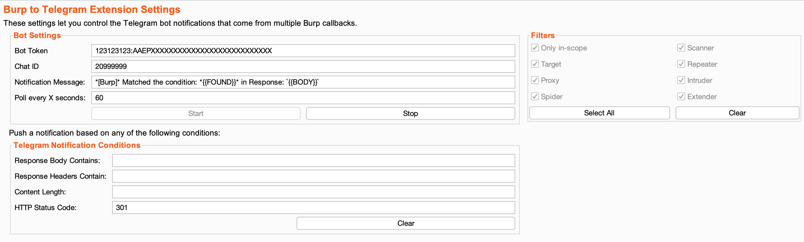
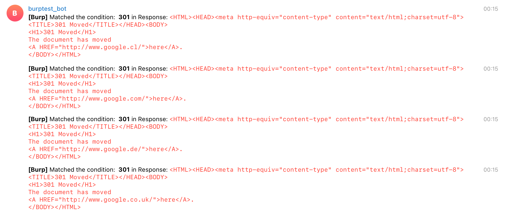

 <h1 align="center">Burp to Telegram</h1>
 
 

## Burp to Telegram view

## Telegram chat view

Push notifications to Telegram bot on BurpSuite response conditions.

### Burp to Telegram
Burp2Telegram extension matches all BurpSuite traffics (Intruder, Repeater, Proxy and Scanner) based on "any" of the user input conditions such as, 
- If the input string exists in the response body
- If the input string exists in the response headers
- If the response content-length is (equal, greater than, less than or doesn't equal) the user input content length
- If the input status code matches the response one.

When one of the above conditions met, then it pushes a notification to either a Telegram bot. The notification message is customized and can be edited/formatted by the user to get the met "condition/s" and/or the HTTP response body that includes the conditions. 

### Main Features
* Poll Notifications every X seconds.
* Customize your notification using {{FOUND}} which is your input condition and {{BODY}} which returns response body.
* Match response body, HTTP headers, content length and HTTP status code.
* Use the logical operators !, =, < and > in the content length field.
* Match Burp proxy, Repeater, Intruder and Scanner/Spider.

#### Build the Project
Use the following command to build the Jar file.
> mvn clean install

#### TODO:
    - [ ] (Regex/case sensitive/negative search) body response
    - [ ] Match more options 
    - [ ] interact.sh to Telegram
    - [ ] Support both Telegram webhook and custom HTTP listeners.

#### Bugs / Feedback / PRs
Any comment, issue or pull request will be highly appreciated :)

#### Author
- Vay3t - https://twitter.com/vay3t - https://gitlab.com/vay3t
- Gonzalo - https://twitter.com/pwner666 - https://gitlab.com/gvillegas

#### Based by: 
b1twis3 - https://github.com/Leoid - https://github.com/PortSwigger/burp-2-slack
